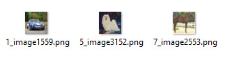
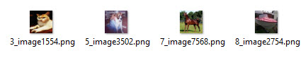

## Attention-based Deep "Multiple Instance Learning" (MIL) turned into "multi-instance multi-label learning" (MIML)
The repo is a modified version of Jiawen Yao's [Atten_Deep_MIL](https://github.com/utayao/Atten_Deep_MIL) that is able to solve a MIML problem

The original code is based on ICML 2018 paper "Attention-based Deep Multiple Instance Learning" (https://arxiv.org/pdf/1802.04712.pdf)

In MIL each bag has only one label, where MIML has bags with miltiple labels.

So what examples can we think of that is MIML
- uploads of 1-n images tags the post with several tags. the MIML problem tries to determine what tag relates to what image
- You might have several images of a car damage, the car might have damages on multiple parts, with MIML you try to determine what part relates to what image

Good read about MIML is [Multi-Instance Multi-Label Learning withApplication to Scene Classification](https://papers.nips.cc/paper/3047-multi-instance-multi-label-learning-with-application-to-scene-classification.pdf)
The paper has this good representation of the different learning frameworks


I was not able to find any MIML image datasets so i desided to use [CIFAR10](https://www.cs.toronto.edu/~kriz/cifar.html) and then randomly put 3-4 images in each bag



bag label = (car,dog,horse)



bag label = (cat,dog,horse,boat)

The challange is then to train the network only knowing the bag labels, and then get a network that will
1. predict the correct labels for a bag
2. predict what label in the bag each image belongs to

### Results from the implementation
The model's are trained for 100 epochs and the results is validated on a unseen testset


|     | bag_accuracy           | instance_accuracy  | true_positive_accuracy  |
| ------------- |:-------------:| :-----:|:-----:|
|class 0 | 0.72 | 0.87 | 0.94|
|class 1 | 0.78 | 0.89 | 0.93|
|class 2 | 0.60 | 0.70 | 0.77|
|class 3 | 0.51 | 0.64 | 0.70|
|class 4 | 0.65 | 0.75 | 0.82|
|class 5 | 0.53 | 0.78 | 0.89|
|class 6 | 0.71 | 0.92 | 0.97|
|class 7 | 0.69 | 0.85 | 0.96|
|class 8 | 0.67 | 0.90 | 0.97|
|class 9 | 0.72 | 0.90 | 0.96|
|**MEAN** | **0.66** | **0.82** | **0.89**|

**bag_accuracy:** The number of bags containing a labe that is predicted to contain that label

**instance_accuracy:** How accurate the system was in selecting an image of a specific class, knowing that the bag is containing at least one image from the class

**true_positive_accuracy:** If the system predicted the bag to contain a class, how accurate it was to select the right image in the bag

### Reflections
I set out to try to solve this problem as i have a big dataset with labeled bags of images. I would like to train a traditional supervised image classifier, howewer that requires that i label each image in the image bags.

One option to was to start labeling at hand, but this is of cause time consuming and should be the last option if all else fails.

If these numbers translates, i would be more than happy to get 66% of my dataset sorted with a 90% accuracy.


### Future Work
Im sure that it is possible to construct the attention layer to support a multi label output, however i have not succeded in getting it to work yet.

To anyone that is able to construct a network architecture that supports Multi label output that works on the MIML dataset there is a price of 12 home brewed beers


### Run the code
Install requirements from requirements.txt and then run main
```console
pip install requirements.txt
python main.py
```


### Dataset
[CIFAR10](https://www.cs.toronto.edu/~kriz/cifar.html)