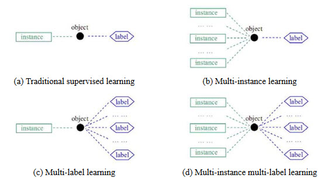

## Attention-based Deep "Multiple Instance Learning" (MIL) turned into "multi-instance multi-label learning" (MIML)
The repo is a modified version of Jiawen Yao's [Atten_Deep_MIL](https://github.com/utayao/Atten_Deep_MIL) that is able to solve a MIML problem

The original code is based on ICML 2018 paper "Attention-based Deep Multiple Instance Learning" (https://arxiv.org/pdf/1802.04712.pdf)

In MIL each bag has only one label, where MIML has bags with miltiple labels.

So what examples can we think of that is MIML
- uploads of 1-n images tags the post with several tags. the MIML problem tries to determine what tag relates to what image
- You might have several images of a car damage, the car might have damages on multiple parts, with MIML you try to determine what part relates to what image

Good read about MIML is [Multi-Instance Multi-Label Learning withApplication to Scene Classification](https://papers.nips.cc/paper/3047-multi-instance-multi-label-learning-with-application-to-scene-classification.pdf)
The paper has this good representation of the different learning frameworks



I was not able to find any MIML image datasets so i desided to use [CIFAR10](https://www.cs.toronto.edu/~kriz/cifar.html) and then randomly put 3-4 images in each bag


bag label = (car,dog,horse)


bag label = (cat,dog,horse,boat)

The challange is then to train the network only knowing the bag labels, and then get a network that will
1. predict the correct labels for a bag
2. predict what label in the bag each image belongs to

### Results from the implementation
#### CIFAR-10
The model's are trained for 100 epochs and the results is validated on a the test set


| | bag_accuracy | instance_accuracy | true_positive_accuracy |
| ------ |:----:|:----:|:---:|
|class 0 | 0.83 | 0.90 | 0.93|
|class 1 | 0.88 | 0.93 | 0.95|
|class 2 | 0.64 | 0.80 | 0.90|
|class 3 | 0.77 | 0.77 | 0.78|
|class 4 | 0.79 | 0.87 | 0.90|
|class 5 | 0.80 | 0.83 | 0.86|
|class 6 | 0.84 | 0.94 | 0.97|
|class 7 | 0.77 | 0.88 | 0.92|
|class 8 | 0.83 | 0.94 | 0.97|
|class 9 | 0.84 | 0.94 | 0.97|
|**MEAN** | **0.80** | **0.88** | **0.92**|

**bag_accuracy:** The number of bags containing a labe that is predicted to contain that label

**instance_accuracy:** How accurate the system was in selecting an image of a specific class, knowing that the bag is containing at least one image from the class

**true_positive_accuracy:** If the system predicted the bag to contain a class, how accurate it was to select the right image in the bag
#### Transfer Learning on Natural Images Dataset
The most natural thing to try to increase performance of a image classification is of cause Transfer Learning. 
The MIML network is a standard convolutional network with attentin at the last layers, 
so it is fairly easy to take a VGG16 and load pre-trained weights trained on ImageNET
(I know VGG16 is not the to exiting but i know it well and is fine as a baseline)

First trained network for 100 epochs without loading pre-trained weights to get a baseline
natural images 100 epochs

| | bag_accuracy | instance_acc | true_positive_acc |
| ------- |:----:|:----:|:----:|
|class 0 | 0.94 | 0.99 | 1.00 |
|class 1 | 0.96 | 1.00 | 0.99 |
|class 2 | 0.94 | 0.92 | 0.92 |
|class 3 | 0.69 | 0.89 | 0.94 |
|class 4 | 0.91 | 0.97 | 0.99 |
|class 5 | 1.00 | 1.00 | 1.00 |
|class 6 | 0.95 | 1.00 | 1.00 |
|class 7 | 0.98 | 1.00 | 1.00 |
|**MEAN**    | **0.92** | **0.97** | **0.98** |

So the base accuracy on [natural-images](https://www.kaggle.com/prasunroy/natural-images) is better than CIFAR-10 properly the bigger image size makes it easier

Then 10 Epochs with pre-trained weights. the VGG16 network weights are frozen, to allow the final layer to train without destroying any of the VGG16 network layers in the process

| |bag_accuracy|instance_acc|true_positive_acc|
|------- |:----:|:----:|:----:|
|class 0 | 0.98 | 1.00 | 1.00 |
|class 1 | 1.00 | 1.00 | 1.00 |
|class 2 | 0.97 | 0.99 | 0.99 |
|class 3 | 0.95 | 1.00 | 1.00 |
|class 4 | 0.97 | 1.00 | 1.00 |
|class 5 | 1.00 | 1.00 | 1.00 |
|class 6 | 1.00 | 1.00 | 1.00 |
|class 7 | 0.99 | 1.00 | 1.00 |
|**MEAN**    | **0.98** | **1.00** | **1.00** |

Not to shabby, best results i have seen on any experimet i have done so fore. this properly is because the dataset contains objects very similar to ImageNet

Next one should try to fine-tune the VGG16 network trainable, so 10 epochs with the "Block 5" trainable

| |bag_accuracy|instance_acc|true_positive_acc|
|------- |:----:|:----:|:----:|
|class 0 | 0.99 | 0.99 | 0.99 |
|class 1 | 1.00 | 1.00 | 1.00 |
|class 2 | 0.89 | 0.99 | 1.00 |
|class 3 | 0.98 | 0.95 | 0.95 |
|class 4 | 0.98 | 0.98 | 0.99 |
|class 5 | 1.00 | 1.00 | 1.00 |
|class 6 | 1.00 | 1.00 | 1.00 |
|class 7 | 0.99 | 1.00 | 1.00 |
|**MEAN**    | **0.98** | **0.99** | **0.99** |

The results from training the last block of the VGG16 network decreased the networks performance.
The VGG16 weights were trained on a large dataset, with little noise, 
This dataset have increased the noise as images from different classes have been joined in one bag, and is also pretty small in size

Fine-tuning might give increases if the dataset is bigger, or if the classes is further from the original ImageNet classes

### Reflections
I set out to try to solve this problem as i have a big dataset with labeled bags of images. I would like to train a traditional supervised image classifier, howewer that requires that i label each image in the image bags.

One option to was to start labeling at hand, but this is of cause time consuming and should be the last option if all else fails.

If these numbers translates, i would be more than happy to get ~~66%~~ 80% of my dataset sorted with a ~~90%~~ 92% accuracy.


### Future Work
I struggled quit a bit to get the output of the network to be multi-class, 
finally i got it to work by repeating the attention layer for each class, and concatenating the output before compiling the model.

As many each class in the multi class classification is quit unbalanced, as a image of a specific class is more oftent not in a bag.

Thanks to Dennis for providing a good [solution for applying class weight to multiclass](https://stackoverflow.com/questions/48485870/multi-label-classification-with-class-weights-in-keras),  A solution that also could be adopted to work with multiple input

Im still happy to give 12 homebrews to anyone that can improve the final layers of the network, still not sure my solution is the optimal :-)


### Run the code
Install requirements from requirements.txt and then run main
```console
pip install requirements.txt
python main.py
```


### Dataset
[CIFAR10](https://www.cs.toronto.edu/~kriz/cifar.html)